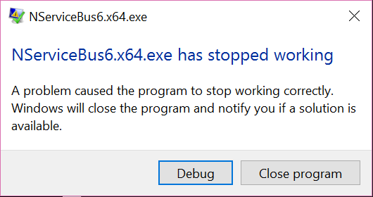
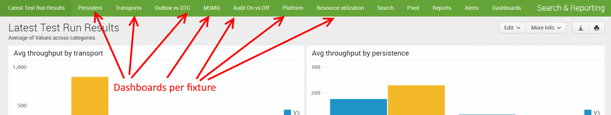

[Buildserver](https://builds.particular.net/project.html?projectId=PerfTests&tab=projectOverview) | [Splunk dashboard](http://deploy.particular.net:8000/en-US/app/search/latest_test_run_results) | [Quick Overview sheet](https://docs.google.com/spreadsheets/d/1SA2aSjPx8HL_m2ct9eWrl3_zmWqxGtMnoooeKK_PzM0/edit#gid=0)

Table of contents

- [Prerequisites for running tests](#prerequisites-for-running-tests)
- [Dependencies](#dependencies)
- [Prerequisites for running tests](#connection-strings)
- [Run it locally](#run-it-locally)
- [Howto prevent 'XXX Has stopped working' dialog](#howto-prevent-xxx-has-stopped-working-dialog)
- [Run Visual Studio as administrator to save disk space](#run-visual-studio-as-administrator-to-save-disk-space)
- [Adding a new scenario](#adding-a-new-scenario)
- [Order of execution](#order-of-execution)
- [Settings](#settings)
- [Corflags.exe](#corflagsexe)
- [How it all works](#how-it-all-works)
- [How to start a run on the Azure test environment](#how-to-start-a-run-on-the-azure-test-environment)
- [Updating the results](#updating-the-results)
- [Viewing latest results](#viewing-latest-results)
- [Updating virtual machines](#updating-virtual-machines)
- [Improving performance](#improving-performance)
- [Tools](#tools)

# Prerequisites for running tests

- Making sure that connection string to MS SQL DB is correct
- Creating empty database manually before first run

# Dependencies

In order to run all permutations you need:

- MSMQ - http://docs.particular.net/nservicebus/msmq/
- RavenDB  - http://ravendb.net/downloads/builds
- SQL Server - https://www.microsoft.com/en-us/download/details.aspx?id=42299
- RabbitMQ (RMQ) - https://www.rabbitmq.com/download.html
- Azure Service Bus (ASB) - https://manage.windowsazure.com/#Workspaces/ServiceBusExtension/namespaces
- Azure Storage Queue (ASQ) - https://portal.azure.com/

All of these can be run locally except for Azure Service Bus. Azure Storage Queues can be run via the Azure Storage emulator but performance is very different from the real service.

# Connection strings

All of these need a correct connection string. There is a connection string template file `.connectionstrings.config.template` at the location of the `readme.md`. This already contains a few connection strings to access all services locally expect for Azure Service Bus.

This template file is copied to two projects during the pre build when they do not exist yet. These files are NOT stored in the repository and are ignored. You can safely edit these and store your own connection strings.

# Run it locally

## Using the front-end

Launching the front-end will give you an easy way to launch a permutation.

Just select the permutation values that you want to use, verify the durations and launch it.

## Using NUnit

You can run the tests just like you would run any other NUnit. Just open the relevant test runner. Select a namespace, fixture or test to run. You will not see the permutations yet because those are dynamic. Run it once and you will see all permutations appearing for that fixture.

# Howto prevent 'XXX Has stopped working' dialog

If a lot of test fail you will get the following dialog:

Add the following registry key to prevent the Windows Error Reporting debug dialog from being displayed.

`HKEY_LOCAL_MACHINE\SOFTWARE\Microsoft\Windows\Windows Error Reporting\@DontShowUI=1(DWORD)`

Source: http://itgeorge.net/disabling-has-stopped-working-dialogs/

# Run Visual Studio as administrator to save disk space

A lot of file copying is done when executing a test. Each permutation of each fixture test is put in its own folder. This can use considerable amounts of storage! When you run Visual Studio as administrator the permutation generation will make use of **symbolic links** instead of copying files and each permutation will use less then 20KB.

You can verify this by opening the corresponding folder in Windows Explorer. The file type should be *.symlink* and the file size should be *0 KB*.

# Adding a new scenario

The current structure is that the **Common** shared project contains a **Scenarios** folder. This contains multiple scenarios where the real scenarios are classes names as `*Runner` like `GatedPublishRunner`, `GatedSendRunner`, `ReceiverRunner`. Each of these scenarios have a corresponding NUnit method in the file `Tests/Categories/Base.cs`. Each scenario has a corresponding method there with the exact same name. This name is used to execute the correct test by the host.

# Order of execution

The following steps are taken to run a scenario.

* Build
* NUnit
* Fixture
* Generate test permutations
* Execute NUnit Test
* Assemble files to permutation folder
* Invoke permutation test host
* Resolve scenario based on executing test
* Run test
* Log results

# Settings

**Duration**

By default the scenario is run for 18 (3+15) seconds for a Debug build and 60 (10+50) seconds for a Release build. It has a warmup and run duration and both can be modified in the appSettings.

**Log output**

A Debug build will log to file, console and trace output and the release build will log to Splunk (network) and only WARN or higher will be logged to file.

This is done via configuration transformations. Open the `App.Release.config` files to see or modify these.

**InvokeEnabled**

The test project has a setting `InvokeEnabled` which by default is set to `True`. When you set it to `False` all NUnit fixtures can be prepared on the file system without actually invoking them. This can be of use to generate all of them during a build and them move them to an environment to actually execute.

# Corflags.exe

In order to run the host as a 32 or 64 bit process the executable is patched using `corflags.exe` and we expect it here:

`%programFiles(x86)%\Microsoft SDKs\Windows\v10.0A\bin\NETFX 4.6.1 Tools\corflags.exe`

You will have to edit this location in post build events of the NServiceBus5 and NServiceBus6 projects.

# How it all works

* Each persistence and transport has its own project. These projects target a specific major version for their two master dependencies (NServiceBus and the downstream package).
* Each NServiceBus major version has a host.
* The unit test project defines category fixture. Such a fixture defines a set of permutations.
* The permutations are generated as a NUnit data source.
* Then a test is run the permutation is generated to a folder.
* The generated permutation is invoked.
* The test waits until the run is finished or crashed but kills it if it takes too long.
* The results from the test run is published to a Splunk server for analysis

# How to start a run on the Azure test environment

To start a run on the Azure VM configuration you need to go the the project on the build server and select Run  

* https://builds.particular.net/project.html?projectId=PerfTests&tab=projectOverview

This will prepare the environment and run the tests. Currently this takes about 4.5 hours to complete.

# Updating the results

All tests are run automatically when the PerformanceTests project is updated. Each test run could take up to 3 hours to complete, but results are published to Splunk as they complete.

If newer versions of the transport or persistence packages become available, the related performance test projects should be updated to ensure the tests are run using the latest versions. In the future this updating step could be automated.

# Viewing latest results

The results of the latest performance test run can be seen on the [Splunk dashboard](http://deploy.particular.net:8000/en-US/app/search/latest_test_run_results).  The username and password combination is stored within LastPass.

The initial dashboard will show a summary of the average throughput of each version for each test permutation.  The first two graphs at the top of the page show the Average throughput per transport, and the Average throughput per persistence.  It is important to note that these numbers are average values of all the permutations that contain those transports and persistences.

To drill into further detail, each fixture also has it's own dashboard.

####Example:

To drill into the details of the performance differences of the transports, click on the `Transports` link on the navigation menu. This will load the dashboard specific to the different Transport performance tests.

This dashboard shows the throughput of the individual tests included within the test fixture. In the case of the Transports test, a simple throughput comparison between `Azure Service Bus`, `MSMQ` and `RabbitMQ` are the current tests.

The second graph shows a historical track of the performance of the transports. This is helpful to prevent accidental investigations where a performance problem is actually due to an isolated environmental issue.

The other dashboards included allow the drilldown into the following fixtures:

* Persistors
* Outbox vs DTC (including message size permutations)
* MSMQ (Send vs SendLocal vs Receive)
* Audit vs Outbox vs DTC (including message size permutations)
* Platform (x86 vs x64, gc Server vs gc Client)
* Resource utilization (similar to platform, but with concurrency set to sequential)

# Updating virtual machines

Changing anything on the VM’s requires:

* Running the initialize VM step
* RDP into the VM
* Make the changes
* Shutdown the MV without running Sysprep
* Create image with a new name
* Run shutdown VM step
* Update TC script with new image name
 
You can test the TC build configurations and pause them to prevent the next configuration to be executed.

# Improving performance

Although it sounds obvious when reading make sure that:

* No virusscanner is active, (temporarily) disable Windows Defender real-time protection
* Store your databases, queues and swap files on fast storage like an SSD
* You close resource hogging applications like Zoom and Chrome
* Set Processor Scheduling to *Background services* instead of Programs
* Make sure your drives have enough free space
* Have *Write-through* caching enabled on your drive, also on SSD drives but don't test with *Write-back* caching to prevent data loss
* Choose an Azure data center that is close to you by using a service like http://www.azurespeed.com/ as less latency improves performance for cloud based storage or queues dramatically
* Make sure you have a decent uplink. To push 2,000 messages per second to Azure requires a 40mbps uplink (2,000 * 2KB = 4MB/s ~ 40mbps with overhead) and its likely that you don't have that based on https://github.com/Particular/PlatformDevelopment/blob/master/hardware-register.md
* Have Windows Power Options set to *High Performance* instead of Belanced which doesn't downstep the CPU / RAM clocks

Always try to understand why you are getting a specific result based on the CPU, RAM, disk and network resources used.

# Tools

Benchmark your internet connection. Select a location where the data center is located:
- http://www.speedtest.net/

Benchmark your storage. Press CTRL+Q and select queues 512 and threads 64 and export the IOPS results to text via CTRL+S:
- http://crystalmark.info/software/CrystalDiskMark/index-e.html

Benchmark your CPU:
- http://www.maxon.net/en/produkte/cinebench/

Check your CPU and RAM clock speeds:
- http://www.cpuid.com/softwares/cpu-z.html

# Future work

As soon as a new package is released (for alpha, beta, or release), the corresponding projects within the solution must have their nuget references updated to ensure that the new code is included within the test framework.  The same procedure should be followed for adding additional transports and persisters to the test framework which were not released at the original time of development.
